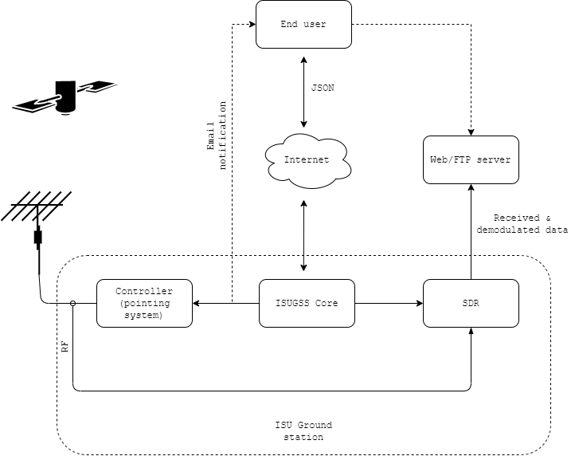
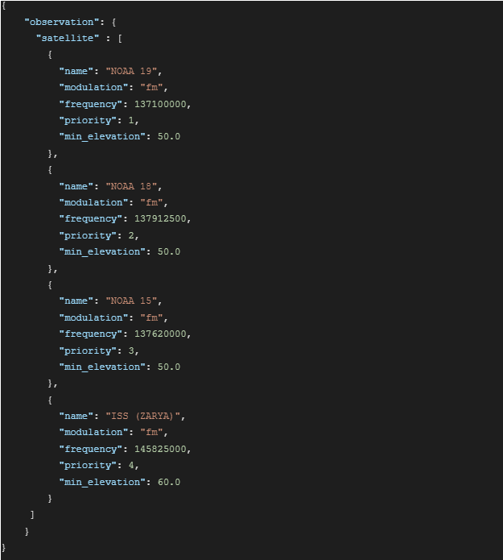
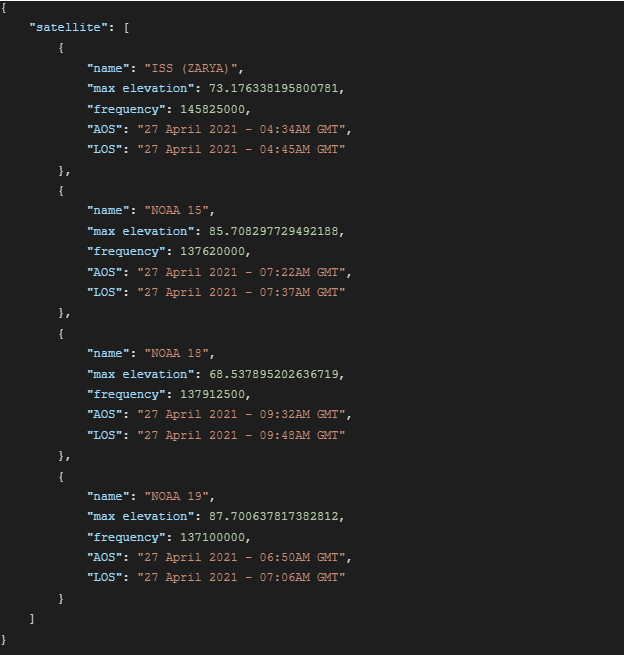
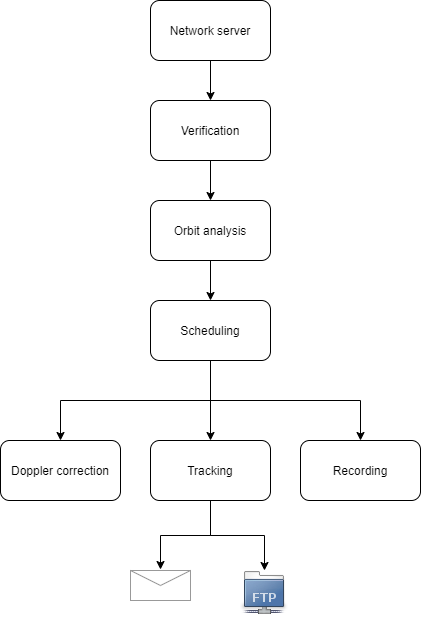
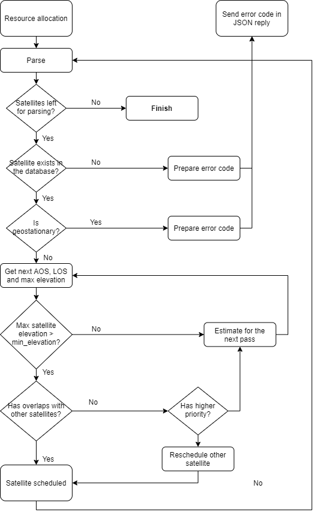
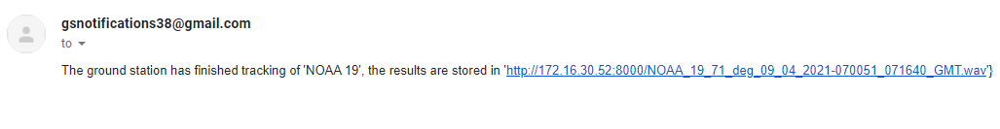
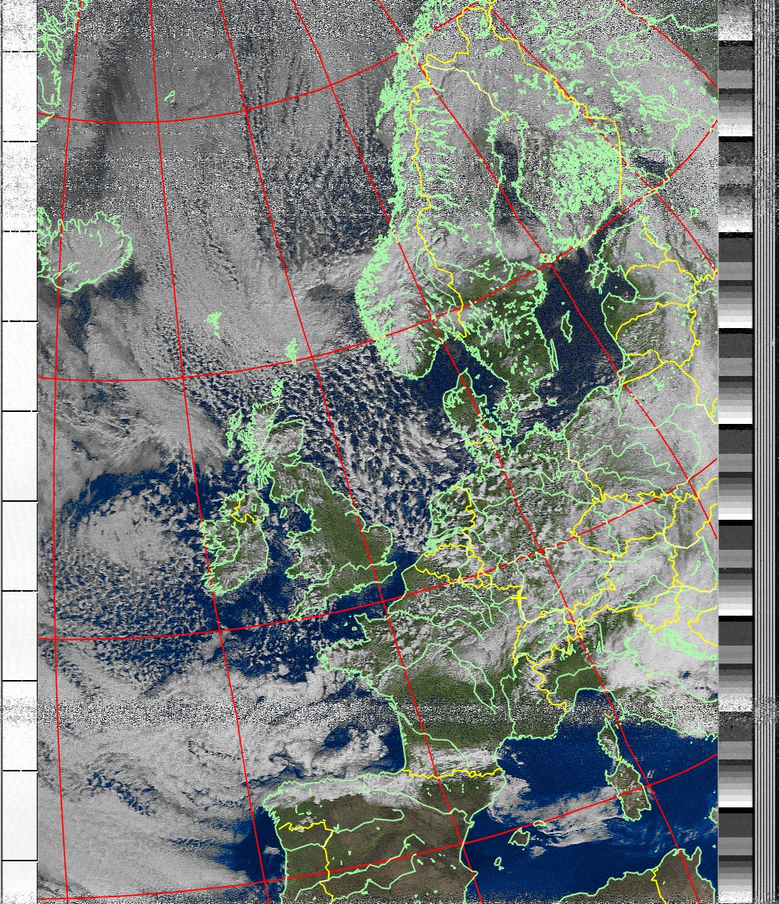

# Ground station core (GSC)

All-in-one open-source utility for SDR-based satellite tracking


## Features

- [x] Compatible with all common SDRs
- [x] Compatible with all common antenna controllers
- [x] Completely autonomous: doesn't need internet connection to operate
- [x] Flexible: uses networking to operate with different parts
- [x] All Unix-based systems supported
- [x] JSON-based configuration
- [x] Doppler compensation
- [ ] Secure connection
- [ ] Config file

## Tests

- [x] NOAA weather satellites
- [x] Voice audio conversations
- [ ] GOES geostationary satellites
- [ ] Meteor satellite
- [ ] Cubesats

# Installation

Install `libpredict`:
```
git clone https://github.com/la1k/libpredict.git
cd libpredict
mkdir build
cd build
cmake ..
sudo make install
```

Install prerequisites
```
sudo apt-get install cmake gcc make predict libjson-c-dev hamlib-utils msmtp msmtp-mta
```

Configure msmtp
https://wiki.archlinux.org/title/Msmtp

Install GSC:
```
git clone https://github.com/skypodolsky/isu_ground_station.git
cd isu_ground_station
mkdir build
cd build
cmake ..
sudo make install
```

GSC will download a list of active satellites.
It will also register a new cron task to update this list every five days.

Configure `gsc_notify.sh` and set relevant e-mails:

```
web_addr="http://172.16.30.52:8000"
sender="gsnotification38@gmail.com"
recipient="stanislav.barantsev@community.isunet.edu"
```

## Launch

Start `rotctld` antenna controlling daemon(-s):

```
#azimuth controller
screen sudo rotctld -s 9600 -m 1004 -r /dev/ttyUSB0 -T 127.0.0.1 -t 8080 -vvvvv

#elevation controller
screen sudo rotctld -s 9600 -m 1005 -r /dev/ttyUSB1 -T 127.0.0.1 -t 8081 -vvvvv
```

Start GSC:
```
screen sudo ./gsc --verbosity 3 --remote-addr 127.0.0.1 --azimuth-port 8080 --elevation-port 8081 --request-port 25565 --latitude=48.31237 --longitude=7.44126
```

# Architecture

## Main software structure
The main concept of the GSC is based on core architecture, which means that all main features are provided by a functional core block, in which all interaction with other utilities is strictly defined. The architecture is portable, which means that it can be moved without almost any changes to other Unix-based platforms (f.e., Raspberry PI, Debian, Ubuntu, Mint, etc). The product is written in C and compiled with CMake, which makes its deployment easier on different Linux platforms.

The architecture consists primarily of the following subsystems:
 - Configuration server
 - JSON REST API
 - Configuration parser
 - Block for orbit prediction
 - Block for antenna handling
 - Block for SDR interaction
 - Block for scheduling satellites
 - Notification system



Antenna rotators’ controllers are programmed by rotctld daemon. It is a part of Hamlib library, which is widely used as a software controlling unit for ground stations all around the world. It is a standard Linux-based utility that supports a lot of controllers of antenna rotators. Widely used for numerous prediction programs like GPredict, libpredict library for orbit prediction has found an application in this project too. For compatibility with all popular SDRs, SoapySDR library was chosen. It provides a hardware-independent C API for interaction, which is used to control an SDR. The system is configured from console (all static variables, f.e., latitude, longitude, azimuth offset compensation, etc.) and via network requests (dynamic configuration, f.e., tracking configuration). GSC uses a network server to make the second configuration type possible. To provide a reliable solution, libev library for network events handling has been integrated. Last but not least, libjson-c, a C-based library for parsing JSON requests, has also been chosen as a lightweight JSON parsing library.

## Configuration
The utility operates in a fully autonomous mode, allowing it to pass the configuration through the REST API. Fully automated mode means that the system **does not require a network connection to operate**, it needs it only at the dynamic configuration stage. After the system has been configured, the connection isn’t crucial anymore. The configuration requests are transferred with HTTP or HTTPS protocols and invoked in JSON format. The example of JSON REST API POST request is provided below:



The typical response:



## Work sequence


## Satellite scheduling


## Debugging of scheduler
A so-called ‘time travel’ approach was implemented. By ‘time travel’ a virtual change in time is assumed. It means that if we need to simulate a moving satellite that was scheduled to a specific time, we just need to make the system think that this time has arrived. In such a case system will behave exactly as when the real satellite comes over the horizon. There are two time travels possible in the scope of the GSC utility, that provides a full scope of debugging functionality that was needed during development:

 - Time travel to the next satellite’s AOS
 - Time travel to the next satellite’s LOS

The first case in makes it possible to simulate the next satellite: this is important to verify that the antenna positioning system and SDR recording works properly. The second one was useful to estimate the scheduling for a bigger time scale.


## Notification system
As the new demodulated files are placed on the Web Server/FTP server, the author found it useful to notify users about the new data available. Every time when SDR accomplishes the recording process, a report with the link on the new data is sent. Therefore, two tasks are solved:

 - No need to constantly check the next AOS of a satellite: the system will send a notification
 - No need to look for the most recent data among hundreds of other files: the system will send a direct link to the file

From the perspective of Linux, this task was solved with msmtp utility. There is a possibility to attach the file directly to the email, but this functionality isn’t implemented in the current release yet. Despite that, the notification can be done for multiple people/groups (this aspect is disclosed in the documentation).



# Results

## Western Europe from the NOAA 18 satellite on 30 Mar 2021, multispectral analysis instrument


## Northern Sahara and Italy in Map Colored in Infrared (MCIR), NOAA-18, 5 Apr 2021


## France as seen from the NOAA 18 satellite on 6 Apr 2021, multispectral analysis instrument

