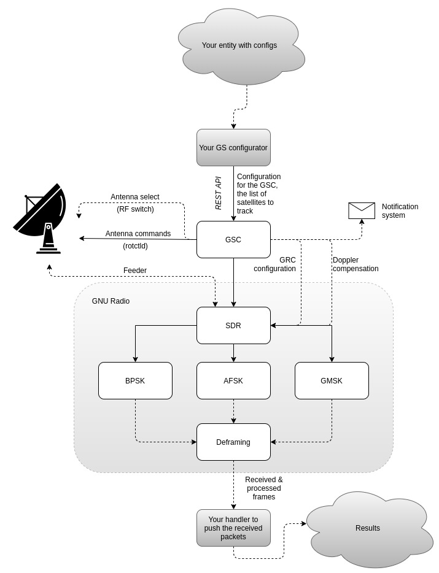
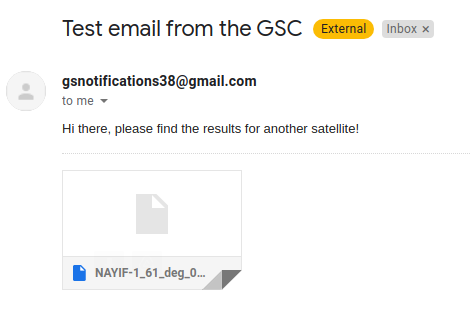
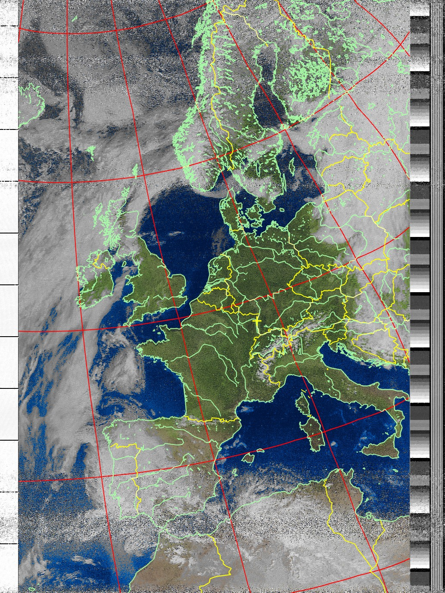

# Ground station core (GSC)

All-in-one open-source utility for SDR-based satellite tracking. All you need to establish your own amateur or professional ground station.


## Features

- [x] Commercially proven
- [x] Compatible with all common SDRs
- [x] Compatible with all common antenna controllers
- [x] Completely autonomous: doesn't need internet connection to operate
- [x] Flexible: customize the digital signal processing with **GNU Radio**
- [x] Flexible: customize needed actions before and after each pass
- [x] Flexible: uses networking to operate with different SW parts
- [x] All Unix-based systems supported
- [x] Read-time status monitoring
- [x] Email notification system
- [x] JSON-based configuration
- [x] Doppler compensation
- [ ] Secure connection
- [ ] Twitter API
- [x] Config file

## Tests

- [x] NOAA weather satellites
- [x] Voice audio conversations
- [x] Two weeks in autonomous beta testing
- [x] Cubesats (BPSK, FSK)

# Installation (Debian/Ubuntu)

Install libpredict:
```
git clone https://github.com/la1k/libpredict.git
cd libpredict
mkdir build
cd build
cmake ..
sudo make install
```

Install prerequisites:
```
sudo apt-get install cmake gcc make predict libjson-c-dev hamlib-utils libxmlrpc-core-c3-dev libconfig-dev python3
```

Install gr-satellites:

https://gr-satellites.readthedocs.io/en/latest/installation.html

Install GSC:
```
git clone https://github.com/skypodolsky/isu_ground_station.git
cd isu_ground_station
mkdir build
cd build
cmake ..
sudo make install
```

GSC will download a list of active satellites.
It will also register a new cron task to update this list every five days.

## Launch

If you have antenna rotators, start `rotctld` antenna controlling daemon(-s):

```
#azimuth controller
screen sudo rotctld -s 9600 -m 1004 -r /dev/ttyUSB0 -T 127.0.0.1 -t 8080 -vvvvv

#elevation controller
screen sudo rotctld -s 9600 -m 1005 -r /dev/ttyUSB1 -T 127.0.0.1 -t 8081 -vvvvv
```

## Create a config file

```
request-port = 25565
gnuradio-config = "/home/stanislavb/sdr_prototypes/master/default"
gnuradio-flowgraph = "/home/stanislavb/sdr_prototypes/master/fmDemod.py"
latitude = 48.711
longitude = 7.711
azimuth-port = 8080
elevation-port = 8081
remote-addr = "127.0.0.1"
verbosity = 3
log_file = "dump.log"
command-script = "/home/stanislavb/isu_ground_station/command_handler.py"
```

Start GSC:
```
screen gsc
```

# Architecture


## Main software structure
The main concept of the GSC is based on core architecture, which means that all main features are provided by a functional core block, in which all interaction with other utilities is strictly defined. The architecture is portable, which means that it can be moved without almost any changes to other Unix-based platforms (f.e., Raspberry PI, Debian, Ubuntu, Mint, etc). The product is written in C and compiled with CMake.

The architecture consists primarily of the following subsystems:
 - Configuration server
 - JSON REST API
 - Configuration parser
 - Block for orbit prediction
 - Block for antenna handling
 - Block for SDR interaction
 - Block for scheduling satellites
 - Notification system


Antenna rotators’ controllers are programmed by rotctld daemon. It is a part of Hamlib library, which is widely used as a software controlling unit for ground stations all around the world. It is a standard Linux-based utility that supports a lot of controllers of antenna rotators. Widely used for numerous prediction programs like GPredict, libpredict library for orbit prediction has found an application in this project too. The system is configured from a config file (all static variables, f.e., latitude, longitude, azimuth offset compensation, etc.) and via network requests (dynamic configuration, f.e., configuration for tracking). GSC uses a network server to process JSON configuration requests. To provide a reliable solution, libev library for network events handling has been integrated. Last but not least, libjson-c, a C-based library for parsing JSON requests, has also been chosen as a lightweight JSON parsing library.

## Configuration
The utility operates in a fully autonomous mode, allowing it to pass the configuration through the REST API. Fully automated mode means that the system **does not require a network connection to operate**, it needs it only at the dynamic configuration stage. After the system has been configured, the connection isn’t crucial anymore. The configuration requests are transferred with HTTP or HTTPS protocols and invoked in JSON format. The example of JSON REST API POST request is provided below:

```
{                              
    "observation": {                   
        "satellite": [          
            {     
                "enabled": true,
                "min_elevation": 10.0,
                "frequency": 145935000,
                "priority": 1,
                "network_port": 7979,
                "name": "FUNCUBE-1",   
                "network_addr": "127.0.0.1",
                "modulation": {             
                    "type": "bpsk",   
                    "bpsk_manchester": false,
                    "bpsk_differential": true,
                    "bandwidth": 20000,
                    "baud_rate": 1200
                },                     
                "deframer": {   
                    "short_frames": false,
                    "crc16": false,
                    "type": "ao-40"
                }
            },
            {
                "enabled": true,     
                "min_elevation": 10.0,      
                "name": "NAYIF-1",    
                "priority": 3,         
                "network_port": 7981,
                "frequency": 145940000,
                "network_addr": "127.0.0.1",
                "modulation": {
                    "bandwidth": 15000,
                    "type": "bpsk",
                    "baud_rate": 1200,
                    "bpsk_differential": true,
                    "bpsk_manchester": false
                },
                "deframer": {
                    "short_frames": false,
                    "crc16": false,
                    "type": "ao-40"
                }
            },            
            {                                
                "frequency": 137620000,          
                "name": "NOAA 15",              
                "network_addr": "127.0.0.1",
                "min_elevation": 30.0,
                                "network_port": 7985,
                "priority": 5,
                "enabled": true,
                "modulation": {
                    "bandwidth": 35000,
                    "type": "fm"
                },
                "deframer": {
                    "type": "fm"
                }
            },
            {
                "frequency": 137912500,
                "name": "NOAA 18",
                "network_addr": "127.0.0.1",
                "min_elevation": 30.0,
                "network_port": 7985,
                "priority": 5,
                "enabled": true,
                "modulation": {
                    "bandwidth": 35000,
                    "type": "fm"
                },
                "deframer": {
                    "type": "fm"
                }
            },
            {
                "network_port": 7985,
                "network_addr": "127.0.0.1",
                "min_elevation": 30.0,
                "frequency": 137100000,
                "priority": 5,
                "enabled": true,
                "name": "NOAA 19",
                "modulation": {
                    "bandwidth": 35000,
                    "type": "fm"
                },
                "deframer": {
                    "type": "fm"
                }
            }
        ]
    }
}
```

The typical response:

```
{
    "satellite": [
        {
            "name": "NOAA 19",
            "max elevation": 73.413566589355469,
            "frequency": 137100000,
            "AOS": "25 November 2021 - 07:08AM GMT",
            "LOS": "25 November 2021 - 07:24AM GMT"
        },
        {
            "name": "NOAA 18",
            "max elevation": 42.980155944824219,
            "frequency": 137912500,
            "AOS": "25 November 2021 - 09:21AM GMT",
            "LOS": "25 November 2021 - 09:37AM GMT"
        },
        {
            "name": "NOAA 15",
            "max elevation": 30.966672897338867,
            "frequency": 137620000,
            "AOS": "25 November 2021 - 06:31AM GMT",
            "LOS": "25 November 2021 - 06:45AM GMT"
        },
        {
            "name": "NAYIF-1",
            "max elevation": 69.686317443847656,
            "frequency": 145940000,
            "AOS": "25 November 2021 - 09:45AM GMT",
            "LOS": "25 November 2021 - 09:57AM GMT"
        },
        {
            "name": "FUNCUBE-1",
            "max elevation": 55.217613220214844,
            "frequency": 145935000,
            "AOS": "25 November 2021 - 03:48AM GMT",
            "LOS": "25 November 2021 - 04:01AM GMT"
        }
    ]
}
```

## Debugging of scheduler
A so-called ‘time travel’ approach was implemented. By ‘time travel’ a virtual change in time is assumed. It means that if we need to simulate a moving satellite that was scheduled to a specific time, we just need to make the system think that this time has arrived. In such a case system will behave exactly as when the real satellite comes over the horizon. There are two time travels possible in the scope of the GSC utility, that provides a full scope of debugging functionality that was needed during development:

 - Time travel to the next satellite’s AOS
 - Time travel to the next satellite’s LOS

The first case in makes it possible to simulate the next satellite: this is important to verify that the antenna positioning system and SDR recording works properly. The second one was useful to estimate the scheduling for a bigger time scale.

## Notification system
As the new demodulated files are placed on the Web Server/FTP server, the author found it useful to notify users about the new data available. Every time when SDR accomplishes the recording process, a report with the link on the new data is sent. Therefore, two tasks are solved:

 - No need to constantly check the next AOS of a satellite: the system will send a notification
 - No need to look for the most recent data among hundreds of other files: the system will send a direct link to the file



# Results

### Western Europe from the NOAA 18 satellite on 30 Mar 2021, multispectral analysis instrument


### Northern Sahara and Italy in Map Colored in Infrared (MCIR), NOAA-18, 5 Apr 2021


### France as seen from the NOAA 18 satellite on 6 Apr 2021, multispectral analysis instrument

